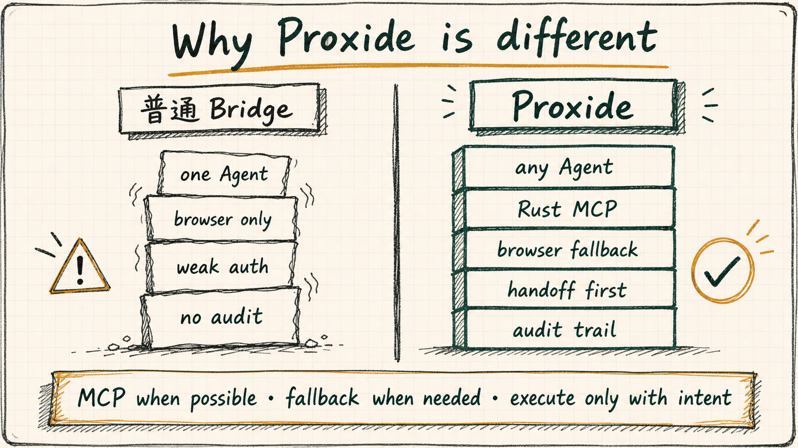

# Proxide

<p align="center">
  <a href="https://github.com/tt-a1i/proxide/releases"></a>
  <a href="https://github.com/tt-a1i/proxide/actions/workflows/ci.yml"></a>
  <a href="LICENSE"></a>
  
  
</p>

<p align="center">
  <strong>Any-agent GPT Pro workspace bridge</strong><br>
  让任意 Agent 通过 MCP 或浏览器 fallback 安全使用网页端 GPT Pro，并把它接到本地仓库。
</p>

<p align="center">
  <a href="#快速开始">快速开始</a> ·
  <a href="#为什么值得用">为什么值得用</a> ·
  <a href="#两种模式">两种模式</a> ·
  <a href="#首次接入-chatgpt-pro">ChatGPT Pro 接入</a> ·
  <a href="#同类项目对比与路线">同类项目对比</a>
</p>

**Proxide** 是一个 agent-agnostic workspace bridge。它不要求 Agent 必须是 Codex：只要 Agent 能运行本地命令、调用 MCP、或通过浏览器/手动粘贴转交上下文，就可以用 Proxide 把本地项目安全交给 ChatGPT Pro、Claude、Grok、Gemini 等网页端强模型。

它的目标不是做一个只读 demo，也不是简单封装浏览器自动化，而是让不同能力层级的 Agent 都能稳定使用网页端强模型：

- **任意 MCP-capable Agent**：启动 Rust connector，让 ChatGPT Pro 或其他 MCP host 读取项目、写 review/edit plan，必要时进入受控执行；
- **任意 browser-capable Agent**：走 Bridge Mode，把 scrub 后的 context packet 发给 ChatGPT Pro、Claude、Grok、Gemini 等网页模型；
- **没有浏览器能力的 Agent**：仍可运行本地 MCP server，把 `/mcp` endpoint 交给网页端 GPT Pro 使用；
- **第一次使用的人**：按 README、FAQ 和 ChatGPT Pro setup runbook 完成安装、诊断、OAuth owner approval 和 smoke test。

它的默认边界仍然很窄：**先做通信和受控 handoff，不替人和目标模型做最终判断**。

新手配置和安全边界可以先看 [FAQ_ZH.md](FAQ_ZH.md) 和 [SECURITY.md](SECURITY.md)。

<p align="center">
  
</p>

## 一眼看懂

| 使用者状态 | 推荐路径 | 能得到什么 |
| --- | --- | --- |
| Agent 支持 MCP 或能启动本地服务 | MCP Connector Mode | ChatGPT Pro 直接通过 MCP 读取项目、写 review/edit plan、必要时受控执行 |
| Agent 只会操作浏览器 | Bridge Mode | scrub 后的 context packet、网页强模型回复、本地 outbox/inbox 交接记录 |
| Agent 不能操作浏览器 | Local MCP endpoint handoff | 把 `/mcp` endpoint 交给网页端 GPT Pro，不需要本地 Agent 控浏览器 |
| 第一次接入 ChatGPT Pro | Release installer + `doctor` + setup runbook | 可复制的安装、诊断、OAuth 授权和 smoke test 流程 |
| 团队担心安全边界 | readonly/review/execute + tool/write/shell modes | 从只读、handoff 到 scoped execution 的渐进式授权 |

## 快速开始

安装 release 版 connector：

```bash
curl -fsSL https://raw.githubusercontent.com/tt-a1i/proxide/main/scripts/install-release.sh | bash
```

初始化一个要开放给 ChatGPT Pro 的 workspace：

```bash
codex-connector init \
  --root /absolute/path/to/project \
  --skill-root "$HOME/.local/share/codex-web-bridge/connector"/codex-web-bridge-connector-*/skills \
  --trust-level readonly \
  --force
codex-connector doctor
codex-connector serve
```

把本地 `http://127.0.0.1:8765` 通过可信 HTTPS tunnel 暴露后，在 ChatGPT Pro developer connector 里填写：

```text
https://<tunnel-host>/mcp
```

完整步骤见 [首次接入 ChatGPT Pro](#首次接入-chatgpt-pro) 和 [chatgpt-pro-mcp-setup.md](skills/codex-web-bridge/references/chatgpt-pro-mcp-setup.md)。

## 为什么值得用

Proxide 吸收了两个相邻方向的优点：[Waishnav/devspace](https://github.com/Waishnav/devspace) 证明了 ChatGPT-local-workspace MCP 对 Agent 编码有价值；[rebel0789/codexpro](https://github.com/rebel0789/codexpro) 强调了首次 setup、doctor、tool mode、handoff/fallback 文档和新手体验。Proxide 在这些基础上做了更适合任意 Agent 的组合：

<p align="center">
  
</p>

- **Rust production MCP server**：生产方向落在 `connector-rs/`，不是临时 Python demo；支持标准 MCP lifecycle、HTTP `/mcp`、session id、OAuth owner approval、owner token 调试和 release 安装。
- **Bridge + Connector 双模式**：有 MCP 的 Agent 走 connector；没有 MCP 或不能连本地服务时，仍可用 browser/manual bridge 把 scrub 后的上下文交给网页强模型。
- **面向 Agent 的工具面预设**：`tool_mode=minimal|standard|full` 控制工具数量，`write_mode=off|handoff|workspace` 控制是否写源码，`shell_mode=off|safe|full` 控制 shell 暴露范围。弱 Agent 不需要看到完整工具集，强 Agent 可以逐步升级。
- **先 handoff，后执行**：`review` / `handoff` 模式允许 ChatGPT 写 review note、edit plan 和 patch preview，但不改 workspace；本地 Codex、Claude Code 或任意其他 Agent 可以接手执行。
- **项目规则和 skills 是一等上下文**：`open_workspace` 会返回 `AGENTS.md`、`CLAUDE.md`、`CONTEXT.md`、嵌套 instruction 文件和显式授权的 skill entrypoints；读取 skill 资源前必须先读对应 `SKILL.md`。
- **编码闭环不是只读查看**：显式 `execute` 后可用 scoped `write` / `edit` / `apply_patch` / `move_path`、safe/full shell、managed Git worktrees、branch publish、PR handoff 和 PR status refresh。
- **ChatGPT Apps UI + 普通 MCP fallback**：支持 `render_changes`、`render_review`、`render_pull_requests`、`render_edit_plans` 等 Apps-compatible cards，同时保留 plain-text/structuredContent 给非 ChatGPT MCP host。
- **更保守的安全默认值**：默认 readonly、allowed roots、canonical path containment、Origin/Content-Type 防护、OAuth scopes、常量时间 token 比对、审计摘要不保存文件正文或 shell 输出。
- **面向发布的安装和验证**：支持 GitHub Release tarball、SHA-256 校验、`install-release.sh`、`doctor`、`verify-release.sh` 和 ChatGPT Pro 首次接入 runbook。

## 能力矩阵

| 层级 | 代表能力 | 是否改 workspace | 适合场景 |
| --- | --- | --- | --- |
| Bridge Mode | context packet、scrub、browser/manual handoff、response capture | 否 | 借用网页强模型做规划、审查、解释 |
| `readonly` connector | `open_workspace`、`read`、`search`、`list`、`git_status`、`git_diff`、`preview_patch` | 否 | 第一次接入、只读审查、低风险远程上下文 |
| `review` / `handoff` | `create_note`、`create_edit_plan`、`update_edit_plan_status`、`render_review`、`render_edit_plans` | 不改源码 | GPT Pro 写计划，本地 Agent 执行 |
| `execute` connector | `write`、`edit`、`apply_patch`、`move_path`、safe/full `shell`、worktree、publish、PR handoff | 是，受 allowed roots 和 mode 约束 | 授权后的真实编码闭环 |

<p align="center">
  
</p>

## 功能边界

Bridge Mode 负责：

- 从当前 repo、diff、未跟踪文件、指定证据文件和用户问题生成 context packet；
- 外发前扫描常见 secret、token、private key、内部 URL 等风险；
- 用 `.codex-web-bridge/outbox` / `.codex-web-bridge/inbox` 保存可追踪的本地交接记录；
- 让用户选择普通 Chrome/浏览器、Codex 应用侧边栏浏览器或手动粘贴；
- 通过浏览器把 packet 发给 ChatGPT Pro、Claude、Grok、Gemini 等网页模型；
- 等待模型生成完成并抓取完整回复；
- 把回复交回本地 Agent 或用户。

Bridge Mode 不负责：

- 判断模型回答对不对；
- 强制本地 reconciliation；
- 自动决定 `FIX / DEFER / DISMISS`；
- 让网页模型直接改本地代码或运行本地命令；
- 未经确认发布社交评论、上传文件或执行外部副作用。

MCP Connector Mode 负责：

- 暴露用户授权 workspace 的 MCP 工具面；
- 发现项目 instruction、skills、Git 状态和 bounded 文件内容；
- 在 `review` / `handoff` 模式下保存 review note、edit plan 和 patch preview；
- 在显式 `execute` + 合适 mode 下执行 scoped 文件修改、受控 shell、worktree 和 PR handoff；
- 给 ChatGPT Apps 和普通 MCP host 返回结构化结果、compact `_meta` 和本地 audit/session state。

## 两种模式

### Bridge Mode

这是当前已实现的 browser/manual fallback：本地 Agent 打包上下文，scrub 之后通过普通 Chrome/浏览器、Codex 应用侧边栏浏览器或手动粘贴发送给 ChatGPT Pro、Claude、Grok、Gemini 等网页模型，再把回复带回本地 Agent。

适合：

- 本地 Agent 支持浏览器操作；
- 用户只想借用网页强模型做规划、审查、解释；
- 不希望网页模型直接读写本地文件或运行命令。

### MCP Connector Mode

这是当前生产方向：启动一个本地 Rust MCP connector，让 ChatGPT Pro、Claude 或其他 MCP host 连接到用户允许的本地 workspace。这样即使本地 agent 不支持浏览器操作，也可以让网页端 GPT Pro 使用本地项目上下文。

这个模式和 Bridge Mode 的信任边界完全不同：Connector Mode 是网页模型主动调用本地工具。默认只读，只开放 workspace、项目指令发现、嵌套指令文件索引、skill 入口发现、受控 skill 资源读取、read、search、list、git status/diff、patch preview、session 审计、review note / edit plan 恢复、managed worktree 列表等能力；`write` / `edit` / `apply_patch` / `move_path` / `shell` / `open_worktree` / `open_workspace(mode="worktree")` / PR 发布与状态刷新只在显式 `trust_level=execute` 时出现。

参考设计见 [skills/codex-web-bridge/references/mcp-connector-mode.md](skills/codex-web-bridge/references/mcp-connector-mode.md)。

`connector-rs/` 下提供生产方向的 **Rust MCP server**，刻意独立于 Bridge Mode 的 skill 运行态。它实现了标准 MCP 生命周期（`initialize` → 可选 `notifications/initialized` → `tools/list` / `tools/call`）；HTTP 场景里 `initialize` 响应头会返回 `Mcp-Session-Id`，后续请求回带即可调用工具。因此 ChatGPT Pro、Claude 等 MCP host 可以直接连接。`connector/` 下的 Python 实现保留为已验证 reference，新的 MCP 服务能力默认落到 Rust：

```bash
# 1. 初始化配置（allowed_roots 必须指向具体仓库，不能是 ~ 或 /）
./bin/codex-connector init --root /absolute/path/to/project --skill-root /absolute/path/to/codex-pro/skills

# 持久 ChatGPT / GPT Pro connector：填 tunnel / public origin，不要带 /mcp
./bin/codex-connector init --root /absolute/path/to/project --skill-root /absolute/path/to/codex-pro/skills --public-base-url "https://<tunnel-host>" --force

# 2. 启动本地 connector（默认绑定 127.0.0.1；是否需要 owner token 取决于配置）
./bin/codex-connector serve

# 3. 诊断本地 setup
./bin/codex-connector doctor

# 4. 运行 Rust connector 测试和 Python reference 回归测试
cargo test --manifest-path connector-rs/Cargo.toml
python3 -m unittest discover -s connector/tests -t .
```

网页端 ChatGPT / GPT Pro 接入时，Connector URL 填公开可达或 Tunnel 暴露的 `/mcp` 地址，例如 `https://<tunnel-host>/mcp`；非 loopback 的 `public_base_url` 必须使用 `https`。持久使用走 Rust connector 的 OAuth owner approval：server 会暴露 protected-resource metadata、authorization-server metadata、authorization code + PKCE、refresh token，并把 owner approval password 与 OAuth token 存在 `state_dir`，不写入仓库配置。`owner_token` 仍保留给本地/自管 MCP client 直接用 `Authorization: Bearer <owner_token>` 调试或自动化。

MCP host 通过 `POST /mcp` 发送 JSON-RPC 2.0 消息。ChatGPT 这类网页端 host 走 OAuth Bearer token；本地自管 client 也可以直接用 owner token。`/rpc` 作为旧本地调试路径继续兼容。`initialize` 会做协议版本协商（支持 `2025-06-18` / `2025-03-26` / `2024-11-05`）并返回 `serverInfo`、`tools` 能力以及响应头 `Mcp-Session-Id`，host 在后续请求里回带该 session id；`notifications/initialized` 会被接受，但 HTTP connector 不依赖它来解锁后续工具调用。`initialize` 之前（除 `ping`）的请求会被拒绝；通知（无 `id`）返回 HTTP 202 空响应。

约定与安全边界：

- `trust_level` 默认 `readonly`；readonly 已包含 `preview_patch`、`list_notes`、`list_edit_plans`、`show_changes`、`show_review`、`show_pull_requests`、`show_edit_plans` 和 Apps-compatible `render_changes` / `render_review` / `render_pull_requests` / `render_edit_plans` 卡片；`review` 增加 `create_note`、`create_edit_plan` 和 `update_edit_plan_status`，只写 connector 状态，不改 workspace；`execute` 需用户显式升级，开放 scoped `write` / `edit` / `apply_patch` / `move_path`、bounded non-interactive `shell`、managed Git worktrees、`open_workspace(mode="worktree")`、`publish_branch`、`create_pull_request`、`refresh_pull_request_status` 和 `refresh_pull_requests`。
- `tool_mode` / `write_mode` / `shell_mode` 用来把 execute 上限继续收窄给不同 Agent：`tool_mode=minimal|standard|full` 控制工具选择器大小；`write_mode=off|handoff|workspace` 控制是否允许源码写入、worktree、publish 和 PR 工具，其中 `handoff` 适合只让 ChatGPT 写 review note / edit plan 给本地 Agent 执行；`shell_mode=off|safe|full` 控制 shell 是否出现，`safe` 只允许只读 Git 与常见 test/lint/typecheck/check/build 命令。默认值保持兼容：`tool_mode=full`、`write_mode=workspace`、`shell_mode=full`。
- `state_dir` 下会保存 `workspace_state.json`、`audit.jsonl`、review notes 和 PR body handoff 文件。前者给 `show_session` / `sessions list/show` / `list_pull_requests` / `list_edit_plans` 用，记录 session、workspace id、edit plan intent 和路径摘要、PR handoff 摘要、工具名、workspace-relative path、move from/to、query、cwd、结果状态和 bounded error；不会保存文件正文、PR body、shell 命令正文、patch 正文或 shell 输出。Review note 正文只写入 `review-notes.jsonl`，可通过 authenticated readonly `list_notes` 按 `workspace_id` 恢复；`show_review` / `render_review`、`list_edit_plans` / `show_edit_plans` / `render_edit_plans`、PR handoff 读取工具都需要 OAuth `workspace:read` 或 owner token。no-auth smoke connector 不能读取 note body、edit plan intent 或 PR handoff records。PR body 只写入 `pr-bodies/`，audit/state 不保存 patch diff 正文。Edit plan intent 是本地 state 的可恢复 handoff 内容，但不会进入 audit 或 Apps `_meta` 摘要。
- OAuth scope 会逐工具检查：execute 文件、Git、worktree 和 PR 工具需要 `workspace:write`，`shell` 工具需要单独的 `shell` scope；本地/自管 client 使用 owner token 时不受 OAuth scope 限制。
- 默认绑定 loopback；绑定非 loopback host 必须配置 `owner_token`，owner token 和 OAuth token 都用常量时间比对。
- `public_base_url` 会派生 Host allowlist；公网隧道 URL 不是 secret，真正的保护是 OAuth owner approval 或 owner token。
- 校验 `Origin` 头防 DNS-rebinding，要求 `Content-Type: application/json` 防浏览器 simple-request 伪造，`GET` / `DELETE` 返回 405。
- 所有 workspace 相对路径都强制包含校验（canonical path containment），拒绝绝对路径、`..`、final symlink；`search` 对每个候选重新校验并跳过 symlink，避免树内 symlink 读到 root 外文件。
- `open_workspace` 不回传本机绝对路径（只回 basename）；它会返回根目录 `AGENTS.md` / `CLAUDE.md` / `CONTEXT.md` 内容、嵌套指令文件路径，以及显式配置或 workspace-local 自动发现的 skills 的 `skill://.../SKILL.md` 入口。自动 skill discovery 默认开启，只会查找 opened workspace 内真实目录 `.pi/skills` 和 `skills`，canonical 后仍必须留在 workspace 内；本机其它 skill 目录必须用 `--skill-root` 显式授权。如需关闭 workspace-local 自动发现，`init` 使用 `--no-auto-skill-roots` 或在 config 中设 `auto_skill_roots: false`。`read` 只有在读过某个 skill 的 `SKILL.md` 后，才允许读取该 skill 目录下其它资源。git 失败只回通用错误，不转发 git stderr。
- MCP tool result 同时返回 `content`、`structuredContent` 和 Apps-compatible `_meta` 摘要；`_meta` 只放路径、计数、状态、字符数等 compact metadata，不重复文件正文、diff 或 shell 输出。
- `search` 有时间、扫描文件数与单文件大小上限；打开的 workspace 数量有上限（LRU 淘汰）。
- 两类错误分流：未知方法/工具、参数错误走 JSON-RPC error；路径逃逸、信任级别不足、文件缺失等走 `isError: true` 的正常结果。

## 首次接入 ChatGPT Pro

给第一次使用的人，或者给“不会操作浏览器、但能运行本地命令”的 agent，完整 runbook 见 [skills/codex-web-bridge/references/chatgpt-pro-mcp-setup.md](skills/codex-web-bridge/references/chatgpt-pro-mcp-setup.md)。这里是最短分工：

- 本地 agent：确认当前 checkout 或解压包包含 `connector-rs/` 和 `skills/codex-web-bridge/`。运行 `./bin/codex-connector init --root <target-project> --skill-root <connector-package>/skills --public-base-url https://<tunnel-host> --force` 创建 `connector-rs/connector.local.json`。`--root` 是要开放给 ChatGPT 的目标项目，`--skill-root` 是本项目 checkout/解压包里的 skills 目录。命令会在 `state_dir` 生成 owner approval password；第一次 ChatGPT OAuth 授权页需要它。
- 本地 agent：运行 `./bin/codex-connector doctor` 诊断配置。
- 本地 agent：用 `./bin/codex-connector serve` 启动本地 MCP server。
- 本地 agent：用 Secure MCP Tunnel、ngrok 或 Cloudflare Tunnel 暴露 `http://127.0.0.1:8765`，把 `https://<tunnel-host>/mcp` 交给用户。`public_base_url` 必须和 tunnel origin 一致。
- 用户：在 ChatGPT web 里打开 Settings -> Apps & Connectors / Apps / Connectors -> Advanced settings，启用 Developer mode；然后在 Connectors / Apps & Connectors 里 Create 一个 connector，填入 `/mcp` endpoint。授权页出现时输入本地 agent 给出的 owner approval password。
- 验证：新开一个 ChatGPT 对话，选择这个 connector，让它先调用 `open_workspace`，再调用 `read README.md`。如果能返回 README 第一行标题和工具名，链路就跑通了。
- 收尾：测试完成后关闭 tunnel 和本地 connector；不要长期保留 no-auth 公网隧道。持久使用应保留 OAuth 配置并定期清理不需要的 connector/token。

注意：只安装 `skills/codex-web-bridge` 这个 Codex Skill，不等于安装了 MCP server。MCP server 生产方向在仓库根目录的 `connector-rs/` crate 里，并通过 `./bin/codex-connector` 暴露稳定入口；其他 agent 如果不识别 Codex Skill，也仍然可以直接启动 Rust connector 作为通用 MCP server。

## 同类项目对比与路线

我们比 [Waishnav/devspace](https://github.com/Waishnav/devspace) 和 [rebel0789/codexpro](https://github.com/rebel0789/codexpro) 更晚进入这个方向，所以路线不是只做一个 readonly connector，而是先吸收它们对 Agent 真正有用的部分，再用更严格的信任边界和双模式 fallback 做差异化。

| 参考方向 | 值得学习的能力 | 这里已经吸收的部分 | 这里额外强调的差异 |
| --- | --- | --- | --- |
| DevSpace | ChatGPT 连接本地 workspace、工具卡片、worktree / PR 编码流 | `open_workspace`、readonly/review/execute 分层、Apps-compatible cards、managed worktree、publish branch、PR handoff/status refresh | Rust connector、OAuth owner approval、Bridge Mode fallback、scrub gate、handoff-first 安全流、skill/instruction 发现 |
| codexpro | 新手 setup、doctor、tool mode、handoff、fallback 文档和发布包装 | `codex-connector init`、`doctor`、`tool_mode` / `write_mode` / `shell_mode`、ChatGPT setup runbook、release installer | 不把 query-token URL 当正式认证路径；生产方向用 Rust MCP server；skill roots 显式授权；audit/state 默认不保存文件正文、patch 正文或 shell 输出 |

当前追平计划见 [docs/devspace-parity-roadmap.md](docs/devspace-parity-roadmap.md)。剩余重点主要是产品成熟度：更丰富的 ChatGPT Apps 交互、registry/tap/npm wrapper 安装入口、持续 PR review 看板和更完整的跨平台运行验证。

## 安装

任意 Agent / MCP host 优先安装通用 connector：

```bash
curl -fsSL https://raw.githubusercontent.com/tt-a1i/proxide/main/scripts/install-release.sh | bash
```

这个脚本会下载对应平台的 release tarball、校验 SHA-256、把 `codex-connector` 安装到 `~/.local/bin`，并保留解压包里的 `skills/` 目录用于 `codex-connector init --skill-root ...`。Release workflow 为 Linux x86_64 和 macOS arm64 上传 tarball 与 checksum；发布步骤见 [docs/release.md](docs/release.md)。macOS Intel 和源码 checkout 用户仍可用：

```bash
./scripts/install-connector.sh
```

如果你使用 Codex，并且只需要 browser/manual Bridge Mode，可以单独安装可选 Codex Skill：

```text
Use $skill-installer to install https://github.com/tt-a1i/proxide/tree/main/skills/codex-web-bridge
```

安装后重启 Codex。

如果需要 MCP Connector Mode，不要只安装 skill 子目录；请 clone 或安装包含 `skills/codex-web-bridge/`、`connector-rs/`、`bin/codex-connector` 的完整项目分发。已只安装 skill 的用户需要升级到完整 checkout，否则只能使用 Bridge Mode，不能启动本地 MCP server。

本地开发时，也可以在仓库根目录用相对路径安装：

```text
Use $skill-installer to install ./skills/codex-web-bridge
```

## 使用

任意 Agent / MCP host 的最短路径：

```bash
codex-connector init --root /absolute/path/to/project --trust-level readonly --force
codex-connector doctor
codex-connector serve
```

然后把 HTTPS tunnel 暴露的 `/mcp` endpoint 交给 ChatGPT Pro、Claude 或其他 MCP host。

Codex Skill 的 browser/manual bridge 用法：

把当前任务发给 ChatGPT Pro：

```text
Use $codex-web-bridge to ask ChatGPT Pro for a plan using the current diff and relevant files.
```

把 bug 上下文发给 Claude：

```text
Use $codex-web-bridge to send this failing test and implementation context to Claude, then bring the answer back.
```

支持的 provider 目标：

- `chatgpt`：ChatGPT / GPT Pro / GPT-5.5 Pro 网页端；
- `claude`：Claude 网页端；
- `grok`：Grok 网页端；
- `gemini`：Gemini 网页端；
- `other`：其他有输入框和输出区的网页模型。

## 工作流

1. 明确要问哪个网页模型，以及要问什么。
2. 用 `build_context_packet.py` 打包上下文。
3. 用 `scrub_context.py` 做外发前扫描。
4. 选择浏览器 surface：普通 Chrome/浏览器、Codex 应用侧边栏浏览器，或手动粘贴。
5. 可选：用 `bridge_handoff.py create` 生成 outbox 目录和可直接粘贴的 prompt。
6. 通过浏览器打开或复用对应网页模型线程。
7. 发送 scrub 通过后的 packet。
8. 等待模型完整回复。
9. 抓取回复，用 `bridge_handoff.py done` 写回 inbox，或直接交回本地 Agent / 用户。

如果选择 Codex 应用侧边栏浏览器，第一次访问对应网页模型时可能需要用户在侧边栏里登录认证一次；它和用户日常 Chrome 登录态不一定共享。

如果本地 agent 不支持浏览器操作，优先考虑 MCP Connector Mode：让网页端 GPT Pro 作为 MCP host 连接本地 connector，而不是要求本地 agent 操作浏览器。

## 脚本

生成 context packet：

```bash
python3 skills/codex-web-bridge/scripts/build_context_packet.py \
  --repo . \
  --provider chatgpt \
  --purpose planning \
  --question "What is the safest implementation plan for this change?" \
  --scope "Current implementation diff" \
  --output /tmp/codex-web-bridge-packet.md
```

扫描敏感内容：

```bash
python3 skills/codex-web-bridge/scripts/scrub_context.py \
  /tmp/codex-web-bridge-packet.md \
  --fail-on block
```

生成本地 outbox 交接：

```bash
python3 skills/codex-web-bridge/scripts/bridge_handoff.py create \
  --repo . \
  --provider chatgpt \
  --purpose planning \
  --surface ask \
  --question "What is the safest implementation plan for this change?" \
  --scope "Current implementation diff"
```

把网页模型回复写回 inbox：

```bash
python3 skills/codex-web-bridge/scripts/bridge_handoff.py done \
  20260617T120000Z-chatgpt-planning \
  --from-clipboard
```

默认生成的 packet 不包含本机仓库绝对路径，减少外发时泄漏本地用户名或目录结构。确实需要时可传 `--include-repo-path`。

`bridge_handoff.py` 默认写入 `.codex-web-bridge/`，该目录是本地运行态，已被 `.gitignore` 忽略。

Rust Connector CLI：

```bash
# 可选：安装 release 二进制到 ~/.local/bin/codex-connector
./scripts/install-connector.sh

# 可选：生成包含二进制、skill、Rust connector 源码和文档的发布包
./scripts/package-connector.sh

# 首次人类用户可直接运行交互式 setup，按提示填写 allowed roots、端口、public URL 和 skill roots
./bin/codex-connector init

# Agent/自动化路径：显式创建配置，默认写入 connector-rs/connector.local.json 并生成 owner token
./bin/codex-connector init --root /absolute/path/to/project

# TTY-attached 脚本如果要保留“默认当前目录且不提问”的旧行为，可以显式关闭交互
./bin/codex-connector init --no-interactive --force

# 可选：让 MCP host 发现随 connector 包发布的 Codex skills
./bin/codex-connector init --root /absolute/path/to/project --skill-root /absolute/path/to/codex-pro/skills --force

# 显式开启文件写入/编辑/shell 工具；不要用于 no-auth 公网隧道
./bin/codex-connector init --root /absolute/path/to/project --trust-level execute --force

# 第一次给 GPT Pro 或能力较弱的 Agent 用：少工具、只写 handoff、不暴露 shell
./bin/codex-connector init --root /absolute/path/to/project --trust-level execute --tool-mode minimal --write-mode handoff --shell-mode off --force

# 允许源码修改，但 shell 只允许测试、lint、build 和只读 git 命令
./bin/codex-connector init --root /absolute/path/to/project --trust-level execute --write-mode workspace --shell-mode safe --force

# ChatGPT / GPT Pro 持久 connector：public_base_url 是 tunnel origin，不带 /mcp
./bin/codex-connector init --root /absolute/path/to/project --public-base-url https://<tunnel-host> --force

# 临时 no-auth smoke test（只用于短时 readonly tunnel，不能配 execute）
./bin/codex-connector init --root /absolute/path/to/project --no-owner-token --force

# 如果已经安装，也可以直接用 codex-connector 代替 ./bin/codex-connector。

# 启动 MCP server
./bin/codex-connector serve

# 检查配置、endpoint 文案、认证状态、Git 是否可用和工具面
./bin/codex-connector doctor

# 查看最近工具调用审计记录
./bin/codex-connector audit

# 查看 MCP session 摘要和详情
./bin/codex-connector sessions list
./bin/codex-connector sessions show <session-id>

# 查看和清理 connector state 下的 managed Git worktrees
./bin/codex-connector worktrees list
./bin/codex-connector worktrees cleanup
```

交互式 setup 如果检测到当前 checkout 下的 `skills/`，会把它作为显式 skill root 默认值；即使不手动填写，Rust connector 也会默认自动发现 opened workspace 内的 `.pi/skills` 和 `skills`。如需关闭自动发现，初始化时传 `--no-auto-skill-roots`，或在 skill root 提示处输入 `none`。

发布前验证：

```bash
./scripts/verify-release.sh
```

这个脚本会运行 Rust fmt/clippy/test/build、Python reference tests、`git diff --check`、wrapper smoke、installer smoke、release package smoke、本地 `/mcp` HTTP smoke，并打印手动 ChatGPT connector smoke prompt。

## 目录

```text
skills/codex-web-bridge/
├── SKILL.md
├── agents/openai.yaml
├── references/
│   ├── providers.md
│   ├── mcp-connector-mode.md
│   ├── chatgpt-pro-mcp-setup.md
│   └── response-capture.md
└── scripts/
    ├── bridge_handoff.py
    ├── build_context_packet.py
    └── scrub_context.py

connector/
├── __init__.py
├── config.py                # trust 模型 + allowed roots 校验
├── workspace.py             # workspace 解析 + 路径包含边界
├── tools.py                 # 只读工具面 + 权限分级 + JSON Schema
├── protocol.py              # MCP 生命周期 (initialize/initialized/tools)
├── server.py                # 本地 HTTP 传输（loopback + owner token）
├── connector.example.json
└── tests/
    ├── __init__.py
    ├── test_connector.py    # 路径包含 + 权限分级测试
    ├── test_protocol.py     # MCP 握手 + tools/list/call 测试
    └── test_server.py       # HTTP 传输端到端（auth/origin/session）

connector-rs/
├── Cargo.lock
├── Cargo.toml
├── connector.example.json
├── README.md
└── src/main.rs              # Rust production MCP connector
```

## 隐私边界

`scrub_context.py` 只能发现常见 secret 形态，不是完整 DLP 系统。外发前仍然要确认上下文是否包含客户数据、内部链接、日志、截图、账号信息或其他不该发送给目标网页模型的内容。

## 关系与授权

Proxide 最初受 [christianaranda/codex-pro-skill](https://github.com/christianaranda/codex-pro-skill) 和 [steipete/oracle](https://github.com/steipete/oracle) 这类“把本地上下文交给强模型”的工作流启发，但现在定位更通用：为任意 Agent 提供连接网页端强模型和本地 workspace 的 MCP / browser bridge。

代码以 MIT License 发布。
