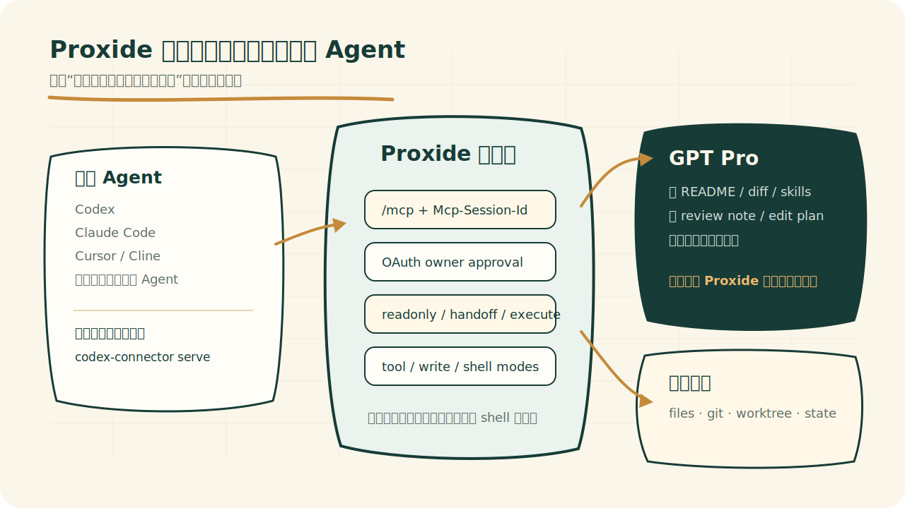
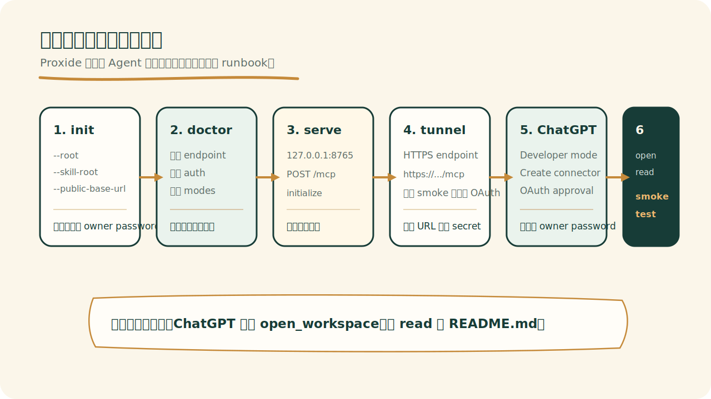

# claude Fable用不了？把Gpt 5.5pro接到你的claude code里


你本地有一个项目，里面有代码、git diff、README、开发约定和一堆还没提交的改动。

你还想借网页端 GPT Pro 看一眼。不是问一个孤立问题，而是让它读这个项目，帮你 review，写一个 edit plan，甚至参与后面的 PR 流程。

麻烦从这里开始。

最粗暴的办法，是让本地 Agent 操作浏览器：复制上下文，粘到 ChatGPT，等回答，再复制回来。这能跑，但边界很松。另一个方向是把本地项目做成一个 MCP server，让网页端 GPT Pro 自己调用工具。这个更强，也更危险：一旦网页模型能调本地工具，它就不再只是“看一段文字”，而是在接触你的 workspace。

[Proxide](https://github.com/tt-a1i/proxide) 做的是中间那层窄门：让网页端 GPT Pro 可以通过受控入口读本地仓库，但不能一上来就拿到本地通行证。

它的第一次测试也很小：只让 GPT Pro 做两件事——先对上项目名（`open_workspace`），再念一遍入口处贴的说明（`read README.md`）。如果它连自己到了谁家门口都说不清，review、edit plan、PR handoff 都先别开。

`open_workspace` 成功以后，ChatGPT 的工具调用面板里只出现了几行很普通的记录：先列资源，再打开 workspace，最后读 `README.md`。这几行记录没什么戏剧性。它背后的分工才有意思：本地 Agent 没有把浏览器当遥控器乱点，也没有把整个家目录交出去。它只是启动了一个本地 Rust MCP server，把一个很窄的 `/mcp` 入口交给网页端 GPT Pro。

很多人讨论 AI coding 的时候，喜欢问“哪个 Agent 更强”。问法没错，但只问了半个问题。**强模型不一定在本地，强 Agent 也不一定会操作浏览器。**

Codex 会跑在本地，Claude Code 会跑在终端，Cursor/Cline 自带一套工具，ChatGPT Pro 又在网页端。它们各自都能做一部分事。本地仓库、网页强模型、工具权限、审计记录——四样东西天然是散的。

MCP 要解决的就是这个：连接。但连上只是第一步。[官方 MCP 规范](https://modelcontextprotocol.io/specification/2025-06-18)把 server 提供的东西分成 resources、prompts、tools；OpenAI 的 [ChatGPT Developer mode](https://developers.openai.com/api/docs/guides/developer-mode) 已经支持 MCP 工具调用，也明说了 read/write 工具很强也很危险。连上以后，谁能看什么、谁能改什么、谁能留下证据，才是真麻烦。

Proxide 的判断很窄：**先把边界做对，再谈自动化。**



## 强模型拿不到本地通行证

最顺手，也最危险。

如果 Agent 能操作浏览器，最简单的方案就是：打包上下文，打开 ChatGPT，粘进去，等回答，复制回来。Proxide 叫这条路 Bridge Mode——自动把项目打成一个精简信息包（管它叫 context packet），扫掉 secret、token、private key、内部 URL，再把 outbox/inbox 留在 `.codex-web-bridge/`。适合借网页模型做规划、解释、审查。

但是 Bridge Mode 有一个硬边界：网页模型不能直接调用本地工具。它得到的是一份上下文，不是一把钥匙。

MCP Connector Mode 是另一回事。这次 GPT Pro 不再只读一份别人打包好的材料——它自己上场，作为 host 主动问本地 Proxide 这个 server 要工具。两边通过 `POST /mcp` 走 JSON-RPC 通信；`initialize` 握手后，connector 发一个 `Mcp-Session-Id`，后面每次调用都带着它，像你去办公楼拿的访客牌。这个时候，网页模型已经越过“看一段粘贴材料”的阶段，可以请求 `open_workspace`、`read`、`search`、`git_diff` 这些工具。

所以 Proxide 没把 MCP 做成一个“全能入口”。默认是 `trust_level=readonly`。

```json
{
  "allowed_roots": ["/Users/you/work/your-repo"],
  "skill_roots": ["/Users/you/work/codex-pro/skills"],
  "trust_level": "readonly",
  "tool_mode": "full",
  "write_mode": "workspace",
  "shell_mode": "full",
  "host": "127.0.0.1",
  "port": 8765,
  "public_base_url": "https://your-tunnel-host.example.com"
}
```

这段配置里最关键的是 `allowed_roots` 和 `trust_level`。前者把仓库范围钉死，后者把权限上限钉死。`open_workspace` 不回传本机绝对路径，只回 workspace 名、项目指令、嵌套 instruction 文件和显式授权的 skill entrypoint。`read` 读 skill 资源时，还有一个小规矩：先读 `SKILL.md`，再读同目录下其它资源。

这听起来啰嗦。可 Agent 系统的很多事故，就是从“不啰嗦”开始的。

## “任意 Agent”不是宣传词

做 Proxide 之前，最值得看的两个相邻项目是 DevSpace 和 codexpro。

DevSpace 证明了 ChatGPT 连接本地 workspace 这件事有用。codexpro 把新手 setup、doctor、handoff、fallback 文档做得更像一个能发布的产品。Proxide 借了这些方向，但没有把自己绑死在某一个 Agent 或某一种浏览器流里。

它的分流很直白，但每条路都有硬边界。

MCP-capable Agent 启动 Rust connector。ChatGPT Pro、Claude 或其它 MCP host 直接接 `/mcp`。它能走标准工具调用，但权限仍然受 `trust_level`、`write_mode`、`shell_mode` 限制。

browser-capable Agent 走 Bridge Mode。打包、scrub、粘贴、抓回复。它能借网页模型思考，但网页模型不能越过 packet 直接读本地文件。

只会运行本地命令的 Agent 也能用。它启动本地 MCP server，把 `/mcp` endpoint 交给网页端 GPT Pro；人完成一次 ChatGPT connector 配置，后面 GPT Pro 自己调用工具。网页授权仍然要人做，Agent 不能替人跳过 owner approval。

这才是“任意 Agent 可用”的实际含义。每个 Agent 不必获得同样的能力，只要能走到自己够得着的那条路径，并且在那条路径上被限制住。

这里要把 skill 和 MCP 分清。

skill 是操作规程。它告诉 Agent 怎么工作，先读什么文件，遇到什么任务该走什么步骤。MCP server 是工具边界。它决定外部模型到底能调用哪些工具，能不能写文件，能不能跑 shell。把这两个混在一起，就会出现一种很危险的错觉：好像写了一份更长的 prompt，就等于有了安全系统。

不是。

一个 skill 如果不能改变 Agent 下一步动作，它只是长 prompt。一个 MCP server 如果不限制动作，它就是公网工具箱。

## 权限不是一个开关

Proxide 的权限设计分三层。


`readonly` 只负责看：`open_workspace`、`read`、`list`、`search`、`git_status`、`git_diff`、`preview_patch`、`show_session`。第一次接入 ChatGPT Pro，就应该停在这里。`preview_patch` 放在 readonly 里，是因为验证一个 patch 的形状，不应该等于应用它。

`review` 或 handoff 层只写 connector state，不改源码。GPT Pro 可以创建 review note、edit plan，更新 plan 状态，或者渲染 `render_review`、`render_edit_plans` 这类 ChatGPT Apps card。本地 Codex、Claude Code 或其它 Agent 再接手执行。

`execute` 才能改 workspace：`write`、`edit`、`apply_patch`、`move_path`、safe/full `shell`、managed worktree、publish branch、PR handoff。即使到了 execute，Proxide 还要再切一刀：

```bash
./bin/codex-connector init \
  --root /absolute/path/to/project \
  --trust-level execute \
  --tool-mode minimal \
  --write-mode handoff \
  --shell-mode off \
  --force
```

`trust_level` 是上限。`tool_mode` 控制它手上能有多少工具，`write_mode` 控制源码写入，`shell_mode` 控制 shell 开不开。第一次给 GPT Pro 或能力较弱的 Agent 用，`minimal + handoff + off` 比“全部打开再相信模型”更像工程。

`shell_mode=safe` 也有实际限制。它只允许常见 check/test/build 命令和只读 Git 命令；`rm`、`git push`、`curl`、`docker`、`sudo` 这种副作用大的命令不该出现在它能碰的工具里。

Agent 写代码最快的时候，是边界已经定好的时候。一旦它同时要猜 ownership、协议形状、迁移顺序和执行权限，速度就会变成返工。

## 第一次接入要让人照着走

很多 MCP 项目会在这里突然跳到“启动服务，然后在 ChatGPT 里配置”。这对第一次使用的人不够。

首次接入拆成了 runbook。Agent 做本地部分，人做网页授权，再用一个很小的 smoke test 验证链路。[OpenAI 的 ChatGPT 连接文档](https://developers.openai.com/apps-sdk/deploy/connect-chatgpt)要求 MCP server 通过 HTTPS endpoint 暴露给 ChatGPT；Proxide 的 runbook 把 tunnel、OAuth owner approval、`doctor` 和 smoke test 放进同一条路径里。



本地命令不用花哨，关键是顺序不能乱：

```bash
./bin/codex-connector init \
  --root /absolute/path/to/the/project \
  --skill-root /absolute/path/to/codex-pro/skills \
  --public-base-url https://example.trycloudflare.com

./bin/codex-connector doctor
./bin/codex-connector serve
```

`init` 负责写配置和生成 owner approval password；`serve` 负责启动本地 MCP server。中间那一步 `doctor` 很容易被跳过，但它才是铰链。endpoint、auth、modes、Git availability、它能调的工具——任何一个不对，ChatGPT 侧配置成功也只是“连到了一个不该信的入口”。

ChatGPT 侧做另一半：开启 Developer mode，创建 connector，填 `https://<tunnel-host>/mcp`，走 OAuth owner approval。Proxide 的文档里保留 no-auth smoke test，但只作为短期 readonly 诊断，不建议长期挂公网。

golden prompt 很小：

```text
Use only the Codex Pro Workspace connector. Do not use web browsing or memory.
First call open_workspace with path /absolute/path/to/the/project, then call
read for README.md. Reply with only the first heading line from README.md and
the names of the MCP tools you used.
```

它只验证两件事：ChatGPT 能调 `open_workspace`，也能 `read README.md`。这一步都不稳定，后面的 review、edit plan、PR handoff 都先别开。

很朴素。也正因为朴素，它比“让 GPT Pro 试着改个小 bug”更像工程测试。

## 审计里不该存正文

权限楼梯解决的是“能不能做”。审计解决的是另一件事：做过什么，能不能被人追回来。

`state_dir` 下面会有 `workspace_state.json`、`audit.jsonl`、`review-notes.jsonl`、`pr-bodies/`。这些东西让 `show_session`、`sessions list/show`、`show_review`、`show_pull_requests` 能恢复上下文，也让人知道 ChatGPT 调过什么工具。

但 audit/state 不保存文件正文、PR body、shell 命令正文、patch 正文或 shell 输出。review note 正文单独进 `review-notes.jsonl`；PR body 单独放 `pr-bodies/`；Apps `_meta` 只放路径、计数、状态、字符数这类 compact metadata。

这不是洁癖。外部模型一旦能调用本地工具，审计自己也会变成另一份数据——跟它该记录的东西同级。把所有正文都塞进 audit，等于把“记录行为”变成“复制 workspace”。审计要能追责，但不能变成第二个仓库。

安全边界里还有几件小事也很要命：

- 默认绑定 loopback；
- 非 loopback 的 `public_base_url` 必须是 HTTPS；
- `Origin` 校验防 DNS rebinding；
- `Content-Type: application/json` 防浏览器 simple request 伪造；
- path 做 canonical containment，拒绝绝对路径、`..` 和 final symlink；
- OAuth scope 逐工具检查，文件/Git/worktree/PR 要 `workspace:write`，shell 要单独 `shell` scope。

这些不适合做宣传标题，但它们决定一个 connector 是 demo 还是能长期放在机器上。工具数量只是外壳，拉开距离的是两件事：权限一层层放，审计不复制正文。

## 它不适合所有场景

Proxide 也不是万能胶。

如果你的目标只是让本地 Agent 问网页模型一个问题，Bridge Mode 或手动粘贴就够了。不要为了“上 MCP”而上 MCP。

如果你准备把 execute connector 长期暴露在一个你不控制的公网入口上，也别用。这个用法从设计上就不该被鼓励。

如果一个团队还没有基本的 review、test、branch、PR 纪律，Proxide 也不会凭空制造纪律。它只能把边界和证据面做出来，不能替团队决定什么代码应该 merge。

更合适的场景是这样的：你已经在用 Codex、Claude Code、Cursor/Cline 或自写 Agent，也想借网页端 GPT Pro 做更强的审查、解释、规划。

但你不想把本地仓库裸交出去。你需要的是一个窄门，不是一张通行证。

Agent 能力在涨，网页端模型也在涨。模型越强，工程问题越尖：你让它看见什么？允许它执行什么？失败时谁接手？证据留在哪里？

下次接一个新的 coding Agent，不要先问它能不能“全自动改代码”。先让它跑一个更小的测试：

能不能只用 `open_workspace` 和 `read` 证明它知道自己连到了哪里。

能，才往下一层走。

仓库地址：https://github.com/tt-a1i/proxide
